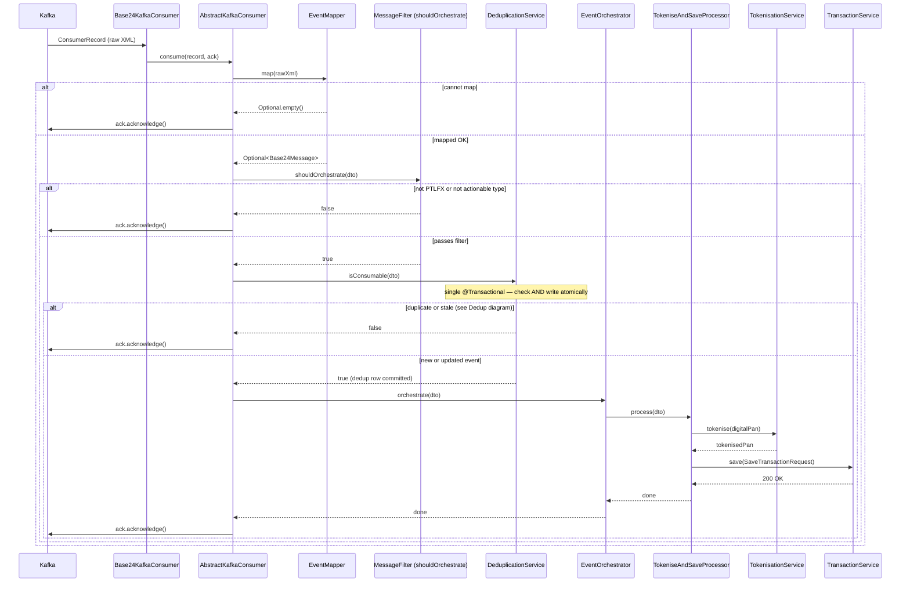
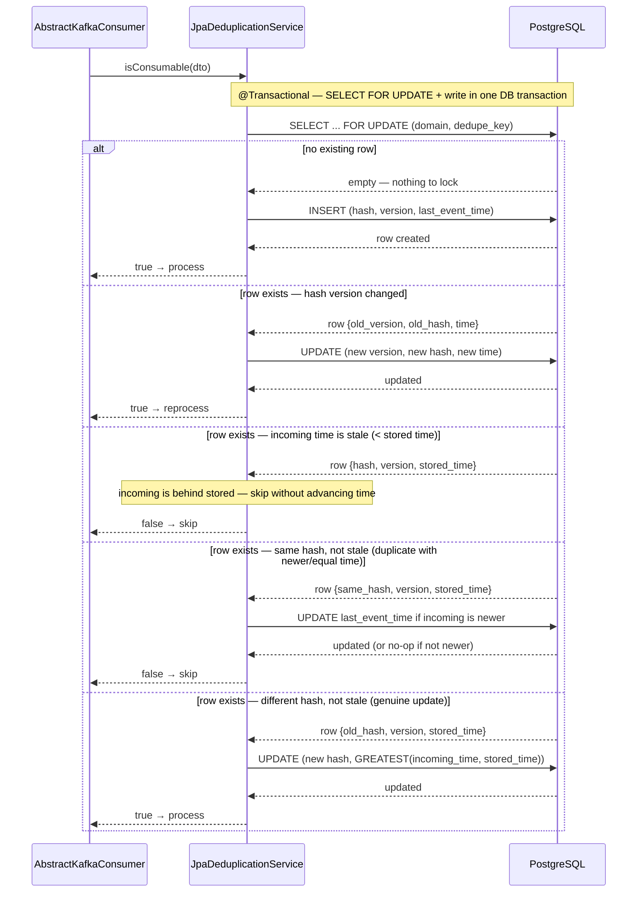

# base24-pipeline

Spring Boot consumer pipeline for the Base24 EPS Real-Time Feed (xEE-SE451 module).

## What it does

Consumes XML `RTFDataRq` Data fragments from a Kafka topic, filters to `PTLFX` record
types, tokenises the digital PAN via `cards-tokenisation-service`, then saves the
event via `transactions/save`.

```
Kafka Topic → Parse XML → Filter PTLFX + TVN/TCN/ACN → Deduplicate → Tokenise DPAN → Save Event
```

---

## Kafka Consumer Flow



---

## Deduplication Decision Flow



---

## Prerequisites

- Java 21+
- Maven 3.8+
- Kafka (for running the app; not required for tests)

---

## Running Tests

```bash
mvn test
```

Most tests are pure unit tests — no Spring context, no Kafka, no HTTP calls.
PostgreSQL deduplication and Kafka end-to-end scenarios use Testcontainers and
are skipped automatically when Docker is not available.

### Testcontainers And Docker Desktop

This project uses Testcontainers `2.0.5`. Docker Desktop's internal `docker.raw.sock`
socket cannot be bind-mounted into containers (Ryuk needs this for resource cleanup).
Use the standard Docker socket instead. Set `~/.testcontainers.properties` to:

```properties
docker.host=unix:///var/run/docker.sock
```

On macOS with Docker Desktop, `/var/run/docker.sock` is a symlink to
`~/.docker/run/docker.sock`, which Docker Desktop exposes correctly.

| Test Class | What it covers |
|---|---|
| `MessageFilterTest` | PTLFX filter + TVN/TCN/ACN actionable rules |
| `Base24XmlParserTest` | XML parsing, field mapping, error cases |
| `AbstractKafkaConsumerTest` | Generic map/dedupe/orchestrate/ack outcomes |
| `ProcessorRoutingOrchestratorTest` | Single/multi processor routing with a made-up consumer event |
| `TokeniseAndSaveTransactionProcessorTest` | Tokenise + save processor behavior |
| `FingerprintHasherTest` | Stable SHA/HMAC hashing |
| `JpaDeduplicationServiceTest` | PostgreSQL dedupe via JPA, stale event handling, hash changes |
| `Base24KafkaConsumerTest` | Topic-specific consumer retry classification |
| `TokenisationAdapterTest` | HTTP adapter with MockRestServiceServer |
| `TransactionAdapterTest` | HTTP adapter with MockRestServiceServer |
| `StubPipelineSmokeTest` | Full pipeline wired with real stubs (no mocks) |
| `AbstractKafkaIntegrationTest` | Shared Testcontainers Kafka, MockServer, topic, publish, DLQ, and offset helpers |
| `Base24KafkaIntegrationTest` | Kafka + HTTP end-to-end behavior with Testcontainers |
| `DeduplicationIntegrationTest` | End-to-end dedup correctness across 5 event rounds at increasing scale (20 → 2 000 transactions) |

### Why `DeduplicationIntegrationTest` Uses a JDK `HttpServer` Instead of MockServer

MockServer is built for **request matching and journaling**: every request it
receives is logged to an in-memory list so that `verify(request, exactly(N))` can
scan and count later. That design works well for small volumes but has two
structural problems at the scale this test exercises (up to 8 000 HTTP calls per
iteration):

| Problem | Effect on this test |
|---|---|
| The request log is unbounded by default | `verify()` scans an ever-growing list; at 4 000+ entries the management API call can exceed RestClient's socket timeout |
| `maxLogEntries` evicts entries FIFO | Setting it below the total request count (e.g. 5 000 with 8 000 calls) evicts tokenise entries before `verify` runs, reporting 0 matches |
| `maxSocketTimeout` only covers management calls | It does not affect the stub response time seen by RestClient; slow responses can still cause `TokenisationException` → Kafka retry → double-counted calls |

The dedup integration test only needs **exact call counts** — it does not inspect
request bodies or simulate error responses. A JDK `HttpServer` serves that need
with zero overhead:

- No request log — `AtomicInteger` counters updated inline in the handler
- In-process — no Docker container, no socket, no serialisation round-trip
- Instant reset between iterations — `counter.set(0)` instead of a management API call
- No eviction risk — counters accumulate monotonically and are read at assertion time

---

## Running Locally (stub mode — no real services needed)

```bash
mvn spring-boot:run -Dspring-boot.run.profiles=stub
```

Stubs log every tokenisation and save event at DEBUG level so you can see
the full consumer processing flow.

To send a test message, use the Kafka console producer:

```bash
kafka-console-producer.sh \
  --bootstrap-server localhost:9092 \
  --topic base24-eps-realtime
```

Then paste a sample PTLFX message:

```xml
<Data>
    <MessageType>TVN</MessageType>
    <RecordType>PTLFX</RecordType>
    <TransactionId>TXN-20240101-001</TransactionId>
    <DigitalPan>4111111111111111</DigitalPan>
    <Amount>123.45</Amount>
    <CurrencyCode>NZD</CurrencyCode>
    <ResponseCode>00</ResponseCode>
    <Timestamp>2024-01-15T10:30:00</Timestamp>
</Data>
```

---

## Running Kafka Only And Debugging In IntelliJ IDEA

Start only Kafka:

```bash
docker compose -f docker-compose.kafka.yml up -d
```

Kafka is available to your host JVM at:

```text
localhost:9092
```

Create an IntelliJ run configuration for `Base24PipelineApplication` with:

```text
Active profile: stub
Environment:
  BASE24_KAFKA_BOOTSTRAP_SERVERS=localhost:9092
  BASE24_KAFKA_TOPIC=base24-eps-realtime
  BASE24_KAFKA_GROUP_ID=base24-consumer-group
```

The `stub` profile keeps tokenisation and transaction saving in-process, so you
can debug the consumer pipeline without the downstream HTTP services.

Stop Kafka when finished:

```bash
docker compose -f docker-compose.kafka.yml down
```

---

## Publishing Test Messages From A Folder

`FolderKafkaPublisher` reads UTF-8 files from a folder and publishes each file to
the configured Kafka topic. It publishes existing files once, and with `--watch`
it keeps running and publishes new or modified files.

Create a local input folder:

```bash
mkdir -p tmp/base24-inbox
```

Add a sample message:

```bash
cat > tmp/base24-inbox/tvn.xml <<'XML'
<Data>
    <MessageType>TVN</MessageType>
    <RecordType>PTLFX</RecordType>
    <TransactionId>TXN-LOCAL-001</TransactionId>
    <DigitalPan>4111111111111111</DigitalPan>
    <Amount>123.45</Amount>
    <CurrencyCode>NZD</CurrencyCode>
    <ResponseCode>00</ResponseCode>
    <Timestamp>2024-01-15T10:30:00</Timestamp>
</Data>
XML
```

Publish plaintext:

```bash
mvn -DskipTests compile exec:java \
  -Dexec.mainClass=com.commercial.cards.base24.tools.FolderKafkaPublisher \
  -Dexec.args="--folder tmp/base24-inbox --bootstrap-server localhost:9092 --topic base24-eps-realtime"
```

Or run the same main class directly in IntelliJ:

```text
Main class:
  com.commercial.cards.base24.tools.FolderKafkaPublisher
Program arguments:
  --folder tmp/base24-inbox --bootstrap-server localhost:9092 --topic base24-eps-realtime
```

For continuous publishing while you edit or add files:

```text
--folder tmp/base24-inbox --bootstrap-server localhost:9092 --topic base24-eps-realtime --watch
```

---

## Publishing And Consuming Encrypted Test Messages

The repo includes a small AES-GCM string serializer/deserializer for local
symmetric encryption testing:

```text
com.commercial.cards.base24.kafka.crypto.AesGcmStringSerializer
com.commercial.cards.base24.kafka.crypto.AesGcmStringDeserializer
```

The encrypted wire format is text with an `aes-gcm-v1:` prefix. The deserializer
passes plaintext through unchanged, so the app can consume both plaintext and
messages encrypted by this local serializer.

Use a 16, 24, or 32 byte key. For local testing, this 16 byte value is valid:

```bash
export KAFKA_SYMMETRIC_KEY=0123456789abcdef
```

In IntelliJ, run `Base24PipelineApplication` with the same `stub` profile and
Kafka environment values from above, plus:

```text
BASE24_KAFKA_VALUE_DESERIALIZER=com.commercial.cards.base24.kafka.crypto.AesGcmStringDeserializer
KAFKA_SYMMETRIC_KEY=0123456789abcdef
```

Publish encrypted files:

```bash
mvn -DskipTests compile exec:java \
  -Dexec.mainClass=com.commercial.cards.base24.tools.FolderKafkaPublisher \
  -Dexec.args="--folder tmp/base24-inbox --bootstrap-server localhost:9092 --topic base24-eps-realtime --secure --key 0123456789abcdef"
```

You can also use a base64 encoded AES key:

```bash
mvn -DskipTests compile exec:java \
  -Dexec.mainClass=com.commercial.cards.base24.tools.FolderKafkaPublisher \
  -Dexec.args="--folder tmp/base24-inbox --bootstrap-server localhost:9092 --topic base24-eps-realtime --secure --key-base64 MDEyMzQ1Njc4OWFiY2RlZg=="
```

If your real environment uses a different organisation-provided symmetric Kafka
serde, set the app deserializer to that class instead:

```text
BASE24_KAFKA_VALUE_DESERIALIZER=com.yourcompany.kafka.crypto.YourDeserializer
```

Then configure that serde using its required environment variables or JVM
properties.

---

## Running With Docker Compose

Build and start Kafka, PostgreSQL, and the pipeline in stub mode:

```bash
docker compose up --build
```

Send a test message from another terminal:

```bash
docker compose exec kafka /opt/kafka/bin/kafka-console-producer.sh \
  --bootstrap-server kafka:9092 \
  --topic base24-eps-realtime
```

Then paste the sample XML above. The app runs with `SPRING_PROFILES_ACTIVE=stub`,
so tokenisation and transaction saving are handled by local stubs and no external
HTTP services are required. Database deduplication is enabled in this compose
file and uses the local `postgres` service.

Stop everything with:

```bash
docker compose down
```

---

## Running Against Real Services

Update `src/main/resources/application.yml`:

```yaml
base24:
  kafka:
    bootstrap-servers: your-kafka-broker:9092
    topic: base24-eps-realtime
    group-id: base24-consumer-group
  services:
    tokenisation-url: http://cards-tokenisation-service
    transaction-url:  http://transactions-service
  dedupe:
    enabled: true
    hmac-secret: your-secret
spring:
  datasource:
    url: jdbc:postgresql://your-postgres-host:5432/base24
    username: your-user
    password: your-password
  flyway:
    enabled: true
```

The schema is applied automatically by Flyway on first startup. No manual DDL
is required. Then run:

```bash
mvn spring-boot:run
```

---

## Project Structure

```
src/main/java/com/commercial/cards/base24/
├── Base24PipelineApplication.java
├── model/
│   ├── MessageType.java          ← TAR | TVN | TCN | ACN | UNKNOWN
│   ├── RecordType.java           ← PTLFX | OTHER
│   ├── Base24Message.java        ← domain model (pure data)
│   └── RtfData.java              ← JAXB binding (update from spec)
├── dto/
│   └── SaveTransactionRequest.java
├── exception/
│   ├── TokenisationException.java
│   └── TransactionSaveException.java
├── port/
│   ├── TokenisationPort.java     ← interface
│   └── TransactionPort.java      ← interface
├── parser/
│   └── Base24XmlParser.java
├── pipeline/
│   └── MessageFilter.java
├── mapper/
│   └── Base24EventMapper.java
├── orchestrator/
│   └── Base24TransactionOrchestrator.java
├── processor/
│   └── TokeniseAndSaveTransactionProcessor.java
├── orchestration/                  ← generic mapper/orchestrator/processor contracts
│   ├── EventMapper.java
│   ├── EventOrchestrator.java
│   ├── EventProcessor.java
│   ├── BaseProcessor.java
│   ├── ProcessorRoutingMode.java
│   └── ProcessorRoutingOrchestrator.java
├── dedupe/                         ← no-op + JPA-backed dedupe
│   ├── DeduplicationService.java   ← single isConsumable(dto): check + write atomically
│   ├── NoOpDeduplicationService.java
│   ├── EventFingerprint.java
│   ├── FingerprintHasher.java
│   ├── Base24EventFingerprint.java
│   ├── EventDeduplicationId.java   ← @Embeddable composite PK
│   ├── EventDeduplicationEntity.java ← @Entity mapping
│   ├── EventDeduplicationRepository.java ← Spring Data JPA repository
│   ├── JpaDeduplicationService.java  ← atomic @Transactional check + SELECT FOR UPDATE + write
│   └── Base24JpaDeduplicationService.java ← Base24-specific @Component
├── consumer/
│   ├── AbstractKafkaConsumer.java   ← generic consume/map/dedupe/orchestrate flow
│   ├── Base24KafkaConsumer.java
│   └── KafkaProcessingRetryException.java
├── adapter/                      ← @Profile("!stub") — real HTTP + CB + Retry
│   ├── TokenisationAdapter.java
│   └── TransactionAdapter.java
├── stub/                         ← @Profile("stub") — local dev only
│   ├── TokenisationStub.java
│   └── TransactionStub.java
└── config/
    ├── KafkaConfig.java
    ├── RestClientConfig.java
    ├── DeduplicationConfig.java
    └── DedupeDataSourceConfig.java

src/main/resources/
├── application.yml
└── db/migration/
    ├── V1__create_event_deduplication.sql
    └── V2__event_deduplication_timestamptz_and_index.sql
```

---

## Kafka Consumer Infrastructure

`KafkaConfig` gives every consumer its own `ConsumerFactory`, `DefaultErrorHandler`,
and `ConcurrentKafkaListenerContainerFactory` bean triple. The three builder helpers
— `buildConsumerFactory`, `buildErrorHandler`, `buildContainerFactory` — carry all
the shared defaults and eliminate copy-paste when adding a second consumer. See the
class-level Javadoc in `KafkaConfig` for the three-step pattern.

Key settings that apply to every consumer:

| Setting | Value | Why |
|---|---|---|
| `enable.auto.commit` | `false` | Manual ack — offset only commits after the record is fully processed or the error handler recovers |
| Ack mode | `MANUAL_IMMEDIATE` | `ack()` commits the offset synchronously rather than batching commits |
| `auto.offset.reset` | `earliest` | Consumer starts from the beginning of a partition when no committed offset exists |
| `max.poll.records` | configurable per consumer | Caps how many records Kafka fetches per poll. **Must be tuned against `max.poll.interval.ms`** — if processing one full batch (sequential HTTP calls per record) takes longer than `max.poll.interval.ms` (default 300 s), Kafka declares the consumer dead and triggers a rebalance. Lower `max.poll.records` or raise `max.poll.interval.ms` accordingly. |
| DLQ naming | `<sourceTopic>.DLQ` if not configured | Each consumer gets an automatically namespaced dead-letter topic |

Retry is exception-driven. Concrete consumers override `isRetriableException` to
decide which domain exceptions should trigger a Kafka retry. The base class wraps
retryable exceptions in `KafkaProcessingRetryException`. `DefaultErrorHandler` is
configured with `Exception.class` as non-retryable and `KafkaProcessingRetryException`
as explicitly retryable — Spring Kafka's classifier resolves the most-specific match
first, so only `KafkaProcessingRetryException` retries; every other exception (programming
errors, permanent data failures, unexpected runtime exceptions) goes straight to the
DLQ on first delivery.

> **Why this matters:** Spring Kafka's `DefaultErrorHandler` retries *all* exceptions
> by default. Without the `addNotRetryableExceptions(Exception.class)` call, a
> permanent bug or bad record would be retried `maxAttempts` times before being DLQ'd,
> wasting time and potentially causing repeated downstream side-effects.

---

## Adding A New Kafka Consumer

The consumer architecture is intentionally split so new topics do not copy the
Base24 processing pipeline.

To add a new consumer:

1. Create a DTO/domain object for the new topic's payload.
2. Implement `EventMapper<I, D>` to map the raw Kafka value into that DTO. Return
   `Optional.empty()` for malformed or unsupported input that should be skipped.
3. Implement `DeduplicationService<D>` if the consumer needs domain-specific
   duplicate detection. For JPA-backed dedupe, provide an `EventFingerprint<D>`
   that exposes the domain, dedupe key, event time, and interesting fields used
   for hashing.
4. Implement one or more `EventProcessor<D>` classes. Extend `BaseProcessor<D>`
   when the processor needs a local `shouldProcess(dto)` filter.
5. Add an `EventOrchestrator<D>`. Prefer `ProcessorRoutingOrchestrator<D>` when
   routing can be expressed as one or more processors selected by
   `shouldProcess(dto)`.
6. Add a concrete Kafka consumer that extends `AbstractKafkaConsumer<I, D>`.
   The class should only bind `@KafkaListener` properties and classify retryable
   domain exceptions in `isRetriableException`.
7. Add configuration properties for the topic, group id, retry settings, DLQ
   topic, downstream URLs, and dedupe settings.
8. Add unit tests for mapper, dedupe fingerprint, processors, orchestrator, and
   concrete retry classification.
9. Add a Kafka integration test that extends `AbstractKafkaIntegrationTest`.
   Reuse `newScenario(...)`, `startApplication(...)`, `publish(...)`,
   `consumeOne(...)`, and `committedOffset(...)` instead of duplicating Kafka
   setup code.

The shared consumer flow is:

```text
Kafka record → mapper → orchestrator pre-filter → dedupe isConsumable (atomic check + write) → orchestrate → ack
```

`isConsumable` is the single point of dedup responsibility. It opens one
`@Transactional` database round-trip that locks the row (`SELECT FOR UPDATE`),
evaluates the dedup rules, and writes the new state — all before any downstream
HTTP call is made. This ensures that a Kafka retry after a downstream failure
will find the row already committed and correctly skip re-processing.

`AbstractKafkaConsumer` also owns trace setup. It reads `trace-id` or `traceId`
from Kafka headers when present; otherwise it generates a UUID. After mapping,
a concrete consumer can override `traceId(dto)` to use a trace ID carried inside
the event DTO. The trace ID is stored in MDC under `trace-id`, included in logs,
and copied by the shared `RestClient` into outgoing HTTP requests as the
`trace-id` header.

Retry is exception-driven. Concrete consumers decide which exceptions are
retryable; retryable failures are wrapped in `KafkaProcessingRetryException` and
retried by Spring Kafka's `DefaultErrorHandler`. All other exception types go
straight to the DLQ on first delivery. After retries are exhausted, the handler
publishes to the configured DLQ and commits the recovered offset.

---

## Deduplication

Deduplication is disabled by default:

```yaml
base24:
  dedupe:
    enabled: false
```

When enabled, the app uses PostgreSQL table `event_deduplication` keyed by:

```text
domain + dedupe_key
```

For Base24 transactions:

```text
domain    = base24-transaction
dedupe_key = transactionId
```

The stored hash is computed from the domain-relevant fingerprint:

```text
messageType
recordType
transactionId
digitalPan
amount
currencyCode
responseCode
```

`timestamp` is not part of the hash. It is used only for event ordering:

```text
no existing row                                   → processed; row inserted
hash version changed                              → reprocessed; row updated
incoming timestamp < stored last_event_time       → skipped as stale
same hash, incoming timestamp ≥ stored time       → skipped; last_event_time advanced if newer
different hash, incoming timestamp ≥ stored time  → processed; row updated
```

If `base24.dedupe.hmac-secret` is set, fingerprints are hashed with HMAC-SHA256.
Otherwise they use SHA-256.

> **Multi-instance requirement:** Producers **must** set the Kafka message key to the
> dedupe key (usually `transactionId`) so all events for the same transaction are
> routed to the same partition and processed by the same consumer instance.
>
> `SELECT FOR UPDATE` only locks **existing** rows — it cannot lock a row that does
> not yet exist. For a brand-new transaction (first occurrence), if two consumer
> instances processed the same event concurrently, both would see an empty result,
> both would decide to process, and both would call downstream services. Key-based
> partitioning eliminates this risk by ensuring only one instance ever sees a given
> key's events.

### Atomic Check-and-Write Design

The dedup decision and the write happen inside a **single `@Transactional` method**
(`JpaDeduplicationService.isConsumable`). The method acquires a `SELECT FOR UPDATE`
lock on the existing row before evaluating any rule, then writes the outcome in the
same database transaction before returning.

This matters for retry safety: because the row is committed before `orchestrate()`
is called, a Kafka retry triggered by a downstream failure (tokenise timeout, save
error) will find the row already present and correctly skip reprocessing.

**Limitation — `SELECT FOR UPDATE` does not protect new rows.** When no row exists
the lock query returns empty and acquires nothing. Two concurrent processors for the
same key would both see "empty", both decide to process, and both call downstream.
This is prevented architecturally by key-based Kafka partitioning (see the requirement
above), not by the database lock itself.

### Schema Management

The `event_deduplication` table is created by Flyway on startup.
Migrations live at:

```
src/main/resources/db/migration/V1__create_event_deduplication.sql
src/main/resources/db/migration/V2__event_deduplication_timestamptz_and_index.sql
```

Flyway is disabled by default (`spring.flyway.enabled=false`). Enable it together
with `base24.dedupe.enabled=true` when running against a real database. Flyway runs
before the application context finishes starting, so the table is guaranteed to
exist before any deduplication check happens.

### JPA Layer

The deduplication store uses Spring Data JPA. Three classes map the
`event_deduplication` table:

**`EventDeduplicationId`** — the composite primary key:

```java
@Embeddable          // marks this class as embeddable inside an entity, not a table of its own
@EqualsAndHashCode   // JPA uses equals/hashCode to track identity in the first-level cache;
                     // without this, two ID objects with the same values would be treated as different keys
public class EventDeduplicationId implements Serializable {
    // Serializable is required by the JPA spec for all primary key classes

    @Column(name = "domain",     nullable = false, length = 100)
    private String domain;       // maps field to the "domain" column; length constrains DDL generation

    @Column(name = "dedupe_key", nullable = false, length = 255)
    private String dedupeKey;    // camelCase field → snake_case column via @Column(name = ...)
}
```

**`EventDeduplicationEntity`** — the table mapping:

```java
@Entity              // registers this class with the JPA provider (Hibernate); makes it a managed entity
@Table(name = "event_deduplication")  // maps to this specific table name; without it Hibernate
                                      // would look for a table named "event_deduplication_entity"
public class EventDeduplicationEntity {

    @EmbeddedId      // the primary key is held in an @Embeddable class rather than a single column;
                     // Hibernate inlines EventDeduplicationId's columns directly into this table
    private EventDeduplicationId id;

    @Column(name = "hash_version", nullable = false, length = 20)
    private String hashVersion;

    @Column(name = "last_hash", nullable = false, length = 128)
    private String lastHash;

    @Column(name = "last_event_time")  // no nullable=false → NULL is allowed; Hibernate generates
                                       // a nullable column in DDL (Flyway handles the actual DDL)
    private LocalDateTime lastEventTime;

    @Column(name = "updated_at", nullable = false)
    private LocalDateTime updatedAt;
}
```

**`EventDeduplicationRepository`** — the data access interface:

```java
// JpaRepository<Entity, ID> provides findById, save, deleteAll, etc. for free
public interface EventDeduplicationRepository
        extends JpaRepository<EventDeduplicationEntity, EventDeduplicationId> {

    @Lock(LockModeType.PESSIMISTIC_WRITE)
    // Issues SELECT ... FOR UPDATE so no other transaction can modify this row
    // between the read and the write within the same @Transactional call.
    @Query("select e from EventDeduplicationEntity e where e.id = :id")
    Optional<EventDeduplicationEntity> findByIdWithLock(@Param("id") EventDeduplicationId id);

    @Modifying(clearAutomatically = true)
    // @Modifying marks the query as a write operation (INSERT/UPDATE/DELETE).
    // clearAutomatically = true flushes and clears Hibernate's first-level cache
    // after the statement runs, so a subsequent findById reads fresh data from the
    // database rather than a stale cached version.

    @Query(nativeQuery = true, value = "insert ... on conflict (domain, dedupe_key) do update ...")
    // nativeQuery = true sends the SQL directly to PostgreSQL without JPQL translation.
    // This is required here because ON CONFLICT ... DO UPDATE is PostgreSQL-specific syntax
    // that has no JPQL equivalent. Spring Data would fail to parse it as JPQL.

    void upsert(@Param("domain") String domain, ...);
    // @Param("domain") binds the method argument to the :domain placeholder in the query string.
    // Without @Param, Spring Data cannot match positional arguments to named placeholders.
}
```

### Auto-Configuration Gate

`spring-boot-starter-data-jpa` ships Hibernate, JPA repositories, Flyway, and
DataSource auto-configurations. When dedupe is disabled, none of those are needed
and their eager startup would fail with no database URL configured.

`Base24PipelineApplication` therefore excludes all database-related auto-configurations:

```java
@SpringBootApplication(exclude = {
    DataSourceAutoConfiguration.class,
    DataSourceTransactionManagerAutoConfiguration.class,
    SqlInitializationAutoConfiguration.class,
    FlywayAutoConfiguration.class,
    HibernateJpaAutoConfiguration.class,
    JpaRepositoriesAutoConfiguration.class
})
```

`DedupeDataSourceConfig` re-enables them via `@ImportAutoConfiguration` when
`base24.dedupe.enabled=true`. `@ImportAutoConfiguration` bypasses the exclusion
list on `@SpringBootApplication`, so the two mechanisms do not conflict.

`@DataJpaTest` uses the same `@ImportAutoConfiguration` mechanism internally and
is also unaffected by the exclusions, so the JPA slice tests work without any
extra configuration.

---

## Resilience

Both adapters use Resilience4j with the following defaults (configure in `application.yml`):

| Setting | Value |
|---|---|
| Circuit breaker window | 10 calls |
| Open threshold | 50% failure rate |
| Open wait | 10 seconds |
| Retry attempts | 3 |
| Retry backoff | 500ms, exponential ×2 |

When the circuit is open or retries are exhausted, the adapter throws a domain
exception. The abstract Kafka consumer asks the concrete consumer whether that
exception is retryable; Base24 currently retries tokenisation and transaction
save failures. Retryable exceptions are wrapped in `KafkaProcessingRetryException`
and handled by Spring Kafka's `DefaultErrorHandler`.

Kafka retry defaults:

| Setting | Value |
|---|---|
| Retry interval | 1000ms |
| Retry attempts | 3 |

After retry exhaustion, the current handler logs the exhausted record and
publishes it to a DLQ. If `base24.kafka.dlq-topic` is blank, the default DLQ
topic is the source topic plus `.DLQ`.

---

## Updating XML Field Mappings

Once the full xEE-SE451 spec is confirmed, update element names in:

```
src/main/java/com/commercial/cards/base24/model/RtfData.java
```

Change the `@XmlElement(name = "...")` annotations to match the real field names.
No other files need to change.
